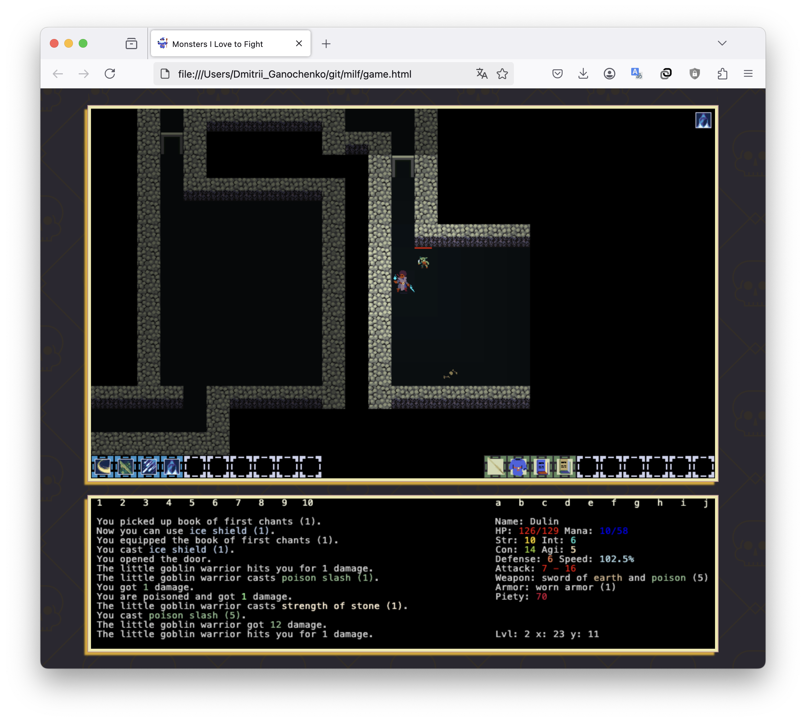

# MILF Roguelike

## Intro.

  </a>  

Explore the infinite dungeon, full of scaling random monsters, items and skills. Play it online [here](https://ganochenkodg.github.io/roguelike-js/).

## Keyboard

<table>
  <thead>
    <tr>
      <th>Key</th>
      <th>Action</th>
    </tr>
  </thead>
  <tbody>
    <tr>
      <td>Arrows, numpad arrows</td>
      <td>Move/Attack/Select target</td>
    </tr>
    <tr>
      <td>Enter</td>
      <td>Go up/Go down/Pick up items/Rest</td>
    </tr>
    <tr>
      <td>a .. j</td>
      <td>Use items from inventory</td>
    </tr>
    <tr>
      <td>1 .. 0</td>
      <td>Use skills</td>
    </tr>
    <tr>
      <td>w</td>
      <td>Worship to God of Random</td>
    </tr>
  </tbody>
</table>

  </a>  

Big thanks to [32rogues](https://sethbb.itch.io/32rogues) free tileset.

